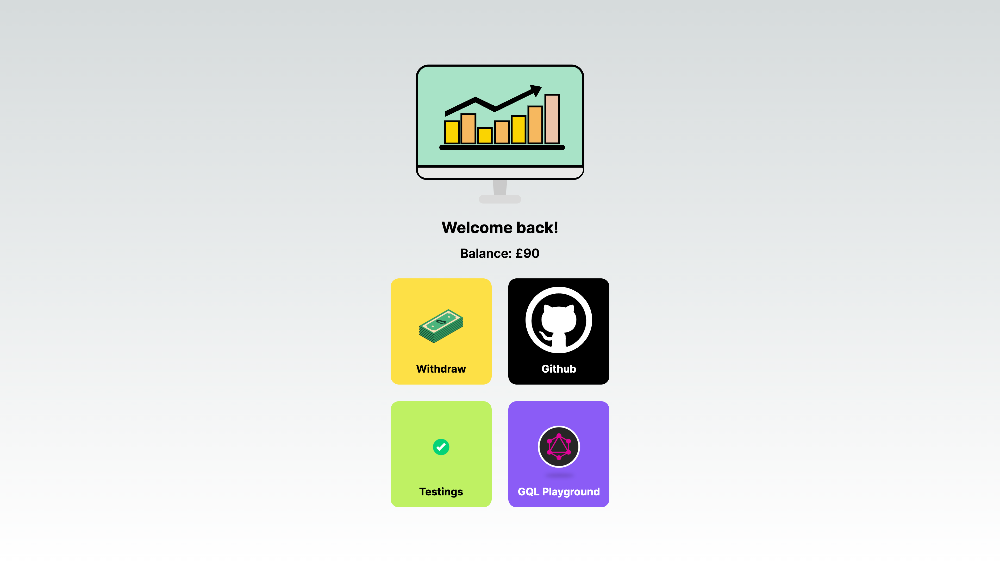
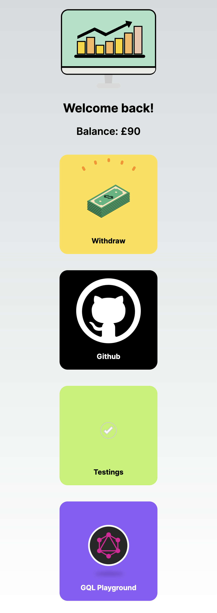

# my-atm

## Prerequisites

1. Node JS version 20.x.x (For multiple node versions use <https://github.com/nvm-sh/nvm>)

2. VS Code

3. Install VS Code extensions

   - ESLint from Microsoft (shows code smell)
   - Prettier from Prettier (shows and auto format code which deviate from coding conventions)
   - Error Lens from Alexander (shows errors/warnings right on that line of code)

   For full list of recommended extensions, see [this file](.vscode/extensions.json)

4. Docker desktop <https://www.docker.com/products/docker-desktop/>

5. Install pnpm (If there's a another pnpm installation remove it first otherwise pnpm won't be updated)

   ```sh
   npm install -g pnpm@latest
   ```

6. Copy .env.example to .env

   ```sh
   chmod +x ./setup.sh
   ```

   ```sh
   ./setup.sh
   ```

7. Start docker container

   ```sh
   pnpm docker:compose
   ```

8. Your desired DB tools (Recommend: TablePlus)

   And test connecting to the DB

9. Install dependencies

   ```sh
   pnpm i
   ```

10. Execute app command from root (See: [package.json](./package.json))

    ```sh
    pnpm [app_name] [command]
    ```

## Backend

NOTE: Sample command are meant to run from root workspace

1. Run migrations

   ```sh
   pnpm backend typeorm:migration:run
   ```

2. Run seed

   ```sh
   pnpm backend seed
   ```

3. Run backend

   ```sh
   # development
   pnpm backend start:dev

   # production mode
   pnpm backend start:prod
   ```

4. Test

   ```sh
   # unit tests
   pnpm backend test:unit

   # e2e tests
   pnpm backend test:e2e

   # coverage report
   pnpm backend test:unit:cov
   pnpm backend test:e2e:cov
   ```

5. Build

   ```sh
   pnpm backend build
   ```

### For additional commands please see "script" section of [package.json](./apps/backend/package.json)

## Frontend

NOTE: Sample command are meant to run from root workspace

1. Run Frontend

   ```sh
   # development
   pnpm frontend dev

   # production mode
   pnpm backend start
   ```

2. Test

   ```sh
   # unit tests
   pnpm frontend test
   ```

3. Build

   ```sh
   pnpm frontend build
   ```

### For additional commands please see "script" section of [package.json](./apps/frontend/package.json)

## Playwright

NOTE: Sample command are meant to run from root workspace

1. Run Playwright test

   ```sh
   # require production build
   pnpm frontend build
   pnpm backend build

   # use webServer to start production build of frontend & backend
   pnpm playwright test
   ```

### For additional commands please see "script" section of [package.json](./apps/playwright/package.json)

## Screenshots & Recordings

### Flow

Going to make 3 withdrawals:

- £140
- £50
- £90

[](https://youtu.be/gaQ9DwkIzuA)

### Responsive

Desktop


Mobile

